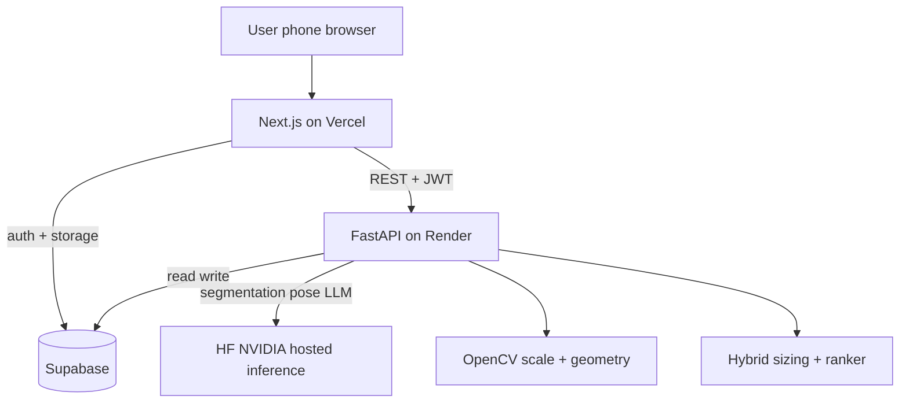

# Requirements

# one8 FitLab — AI Fit & Performance Studio

A standout, portfolio-grade web app for Virat Kohli's **one8** high-performance footwear & sportswear brand. It solves the single biggest e-commerce problem in footwear — **fit-driven returns** — using a phone-camera **AI foot scan**, and layers a **run/gait + goals profile** on top to recommend the *right* one8 shoe for each customer, with an explainable rationale.

### Overview & Goals
- **Business value:** cut return rates, lift conversion & average order value, and reinforce one8's "performance with purpose" positioning with a genuinely differentiated experience.
- **Uniqueness:** most brand sites use static size charts. one8 FitLab measures the actual foot from a photo (real-world scale via a reference object) and fuses it with movement/goal signals — a combination that is rare and hard to copy.
- **Deliverable:** a polished, deployable full-stack app with a live URL to submit alongside the resume.

### Scope
**In scope**
- Guided **AI foot scan**: user photographs a foot on a standard A4 sheet; CV computes length/width and maps to a per-model one8 size.
- **Performance profile**: short run video (optional) analyzed for a basic gait/cadence signal + a quick goals questionnaire (sport, surface, cushioning preference, use case).
- **Hybrid recommendation engine**: deterministic fit mapping + ML/LLM ranking → ranked one8 shoe picks with plain-language reasons and a confidence/fit badge.
- **Result & history**: shareable fit card, saved scans, and a lightweight "why this size" explanation.
- **Mock one8 catalog** (curated demo models with size charts & attributes) seeded in the DB.
- **Premium, on-brand UI** and full deployment.

**Out of scope**
- Real payments/checkout, real one8 inventory integration, native mobile apps.
- Medically precise orthotic measurement or 3D foot reconstruction.

### User Stories
- As a shopper, I want to scan my foot with my phone so I can order the correct one8 size confidently without guesswork.
- As a shopper, I want the app to recommend shoes matched to how and where I run so my purchase fits my performance needs.
- As a shopper, I want to see *why* a size/model was chosen so I trust the recommendation.
- As a returning user, I want my previous scans saved so I can reorder without re-scanning.
- As the one8 team (evaluator), I want to see how this reduces returns and increases conversion so I understand the business impact.

### Functional Requirements
1. **Foot scan flow:** upload/capture a photo of a foot placed on an A4 sheet; system detects the reference object for scale, segments the foot, and returns length & width in cm/mm with a confidence value.
2. **Manual fallback:** if confidence is low or detection fails, prompt the user to enter foot length in cm so they are never blocked.
3. **Sizing:** map measurements to the correct size **per selected one8 model** (each model may fit differently) and show fit tightness (snug/true/roomy).
4. **Performance profiling:** short goals questionnaire (required) + optional run video producing a simple gait/cadence descriptor.
5. **Recommendations:** return a ranked list of one8 models with size, fit badge, match score, and a short rationale referencing both fit and performance inputs.
6. **Persistence:** authenticated users can save scans/results and revisit history; anonymous users get a session-based result.
7. **Shareable fit card:** a visually polished summary the user can screenshot/share.

### Non-Functional Requirements
- **Free-tier friendly:** runs on Vercel + Render + Supabase free tiers using hosted HF/NVIDIA inference (no paid GPU).
- **Privacy:** foot/video media stored in private Supabase Storage buckets; user can delete scans.
- **Performance:** scan result target < ~8s; graceful loading & error states.
- **Responsive & accessible:** mobile-first (scanning happens on phones), keyboard-navigable, good contrast.
- **Deployable & documented:** one-command local run + README with live-demo link and architecture notes.

# Technical Design

### Current Implementation
Greenfield repository (only `README.md`). No existing code or conventions to preserve, so the design establishes a clean, conventional full-stack layout.

### Key Decisions (confirmed with user)
- **Concept:** AI Fit & Performance Studio ("one8 FitLab").
- **Foot measurement:** *reference-object scaling* (A4 sheet / card) for real-world scale + foot segmentation, with a **manual cm fallback** for demo safety and reliability.
- **Recommendation:** *rules + ML/LLM hybrid* — deterministic per-model fit mapping combined with an LLM/heuristic ranker over performance/goal signals; explainable and demo-safe.
- **Stack:** Next.js (Vercel) + FastAPI (Render/Fly) + Supabase (Postgres, Auth, Storage).
- **ML hosting:** hosted inference (Hugging Face Inference / NVIDIA NIM) for segmentation/pose/LLM; lightweight OpenCV runs in FastAPI for geometry — no self-hosted GPU.

### Proposed Changes (new system)
**Frontend — Next.js (App Router, TypeScript, Tailwind)**
- Landing/brand page → guided **Scan Wizard** (instructions → capture/upload → processing → result) → **Profile questionnaire** (+ optional video) → **Recommendations** → **History/Dashboard**.
- State via React Server Components + client hooks; API calls to FastAPI; Supabase JS client for auth/session.
- Design system: dark, high-performance "one8" aesthetic (bold type, motion, product cards) built with Tailwind + a small component library (shadcn/ui) and Framer Motion.

**Backend — FastAPI (Python)**
- `POST /scan/foot` — accepts image; pipeline: detect reference object (contour + known A4 aspect/size) → derive px→mm scale → segment foot (hosted segmentation model, e.g. SAM/rembg-style, via HF Inference) → measure bounding geometry → return `length_mm`, `width_mm`, `confidence`.
- `POST /scan/gait` — accepts short video/frames; hosted pose-estimation inference → derive cadence/stance descriptor + `gait_profile`.
- `POST /size` — maps measurements + selected model to size using per-model charts (deterministic).
- `POST /recommend` — hybrid ranker: filter by fit, score by goals/gait, optional LLM rationale generation (hosted LLM) → ranked list.
- `GET /catalog`, `GET/POST /scans` (persist/list), auth via Supabase JWT verification.

**Database — Supabase (Postgres + Storage + Auth)**
- Tables: `products` (one8 models, attributes, price, image), `size_charts` (model_id, size, length_mm range, width class), `scans` (user_id, media refs, measurements, confidence), `profiles` (goals/gait), `recommendations` (scan_id, ranked payload).
- Private Storage buckets for foot photos & videos; RLS policies scoping rows to `auth.uid()`.

### Data Models / Contracts
```
POST /scan/foot  -> { length_mm, width_mm, confidence, mask_url }
POST /scan/gait  -> { cadence, stance, gait_profile: 'neutral|cushion|stability' }
POST /size       (model_id, length_mm, width_mm) -> { size, fit: 'snug|true|roomy' }
POST /recommend  (measurements, profile) -> [ { product_id, size, fit, match_score, rationale } ]
```

### Architecture Diagram


### File Structure
```
/frontend            Next.js app (app/, components/, lib/supabase, styles)
/backend             FastAPI (app/main.py, routers/, services/cv, services/ml, services/reco, models/)
/backend/data        one8 mock catalog + size charts (seed)
/supabase            SQL migrations + RLS policies + seed
README.md            setup, env vars, live demo link, architecture
```

### Risks
- **Measurement accuracy** on varied lighting/angles → mitigate with strict capture guidance, reference-object validation, confidence gating, and manual fallback.
- **Free hosted-inference limits/latency** → cache results, keep models small, show clear loading states, allow rules-only path if inference unavailable.
- **Cold starts on Render free tier** → document + lightweight warmup; keep payloads small.

# Testing

### Validation Approach
Validate each functional requirement end-to-end with a mix of backend unit tests, API contract tests, and manual UI walkthroughs against the deployed and local environments. ML/CV outputs are validated against a small fixture set of sample foot photos with known real dimensions.

### Key Scenarios
- **Foot scan happy path:** sample photo on A4 → measurements within a reasonable tolerance of ground truth; confidence high; size returned per model.
- **Sizing correctness:** given fixed measurements, `POST /size` returns expected size/fit for each seeded one8 model chart.
- **Recommendation ranking:** given a fit + goals/gait profile, `POST /recommend` returns a stable, explainable ranked list; rationale references the inputs.
- **Persistence:** authenticated user saves a scan, logs out/in, and sees it in history; RLS prevents seeing other users' scans.
- **End-to-end UI:** complete wizard on mobile viewport → recommendations render with fit badges and shareable card.

### Edge Cases
- No reference object / blurry photo → low confidence triggers manual cm fallback (user not blocked).
- Missing/failed hosted inference → graceful error + rules-only fallback path.
- Skipped optional video → recommendations still generated from goals + fit.
- Anonymous session (no login) → result works without persistence.
- Oversized/invalid uploads → validated and rejected with clear messaging.

### Test Changes
- Backend: pytest unit tests for CV scaling math, sizing mapper, and ranker; FastAPI TestClient contract tests for each endpoint.
- Frontend: component tests for the wizard steps and result card; basic form validation tests.
- Fixtures: a few sample foot images + expected measurements committed for repeatable CV checks.

# Delivery Steps

###   Step 1: Scaffold project, on-brand design system & Supabase schema
A running Next.js + FastAPI + Supabase skeleton with the one8 visual identity and seeded catalog is live locally.

- Scaffold `/frontend` (Next.js App Router, TypeScript, Tailwind, shadcn/ui, Framer Motion) with a dark, high-performance one8 theme, landing page, and shared layout/components.
- Scaffold `/backend` FastAPI app with health check, CORS, settings/env loading, and router structure (`scan`, `size`, `recommend`, `catalog`, `scans`).
- Create `/supabase` SQL migrations for `products`, `size_charts`, `scans`, `profiles`, `recommendations`, plus RLS policies and private Storage buckets.
- Seed a curated **mock one8 catalog** (models, attributes, prices, images) and per-model size charts.
- Add README with local run instructions and env-var documentation.

###   Step 2: Build the AI foot-scan CV pipeline
A `POST /scan/foot` endpoint returns foot length/width in mm with a confidence score from a photo taken on an A4 sheet.

- Implement reference-object detection (contour detection + known A4 dimensions) in `services/cv` to compute a px→mm scale.
- Integrate hosted foot **segmentation** inference (HF/NVIDIA) to isolate the foot mask; fall back to classical segmentation if unavailable.
- Compute foot length/width from the scaled mask and derive a confidence value.
- Store uploaded media in a private Supabase bucket and persist measurements to `scans`.
- Add pytest unit tests for the scaling math using committed sample-image fixtures.

###   Step 3: Implement sizing engine + Scan Wizard UI with manual fallback
Users complete a guided scan on mobile and see their correct per-model one8 size and fit.

- Implement `POST /size` deterministic mapper (measurements + model → size + snug/true/roomy) driven by `size_charts`.
- Build the multi-step **Scan Wizard** (instructions → capture/upload → processing → result) in Next.js, mobile-first.
- Wire confidence gating: low confidence/failure routes the user to a **manual cm entry** fallback so they're never blocked.
- Render a fit result view with size, fit badge, and a clear "why this size" explanation.
- Add component tests for wizard steps and validation.

###   Step 4: Add performance profiling (goals + optional gait video)
The app captures a performance profile combining a goals questionnaire and an optional run-video gait signal.

- Build the goals questionnaire UI (sport, surface, cushioning preference, use case) and persist to `profiles`.
- Implement `POST /scan/gait` using hosted **pose-estimation** inference over uploaded video frames to derive cadence/stance and a `gait_profile` (neutral/cushion/stability).
- Handle the optional path gracefully (skipping video still yields a valid profile).
- Store video media privately and persist derived profile fields.
- Add tests/fixtures for the gait descriptor derivation and the skip path.

###   Step 5: Build the hybrid recommendation engine & results experience
Users receive a ranked list of one8 shoes matched to their fit and performance profile with plain-language reasons.

- Implement `POST /recommend`: deterministic fit filtering + a scorer over goals/gait signals, with an optional hosted-LLM layer generating short rationales.
- Add a rules-only fallback path when hosted inference is unavailable.
- Build the Recommendations page: ranked one8 product cards with size, fit badge, match score, and rationale.
- Create the polished, shareable **fit card** summary component.
- Persist recommendations to the `recommendations` table.
- Add ranker unit tests and API contract tests.

###   Step 6: History/dashboard, polish & full deployment
A live, shareable URL where authenticated users can revisit saved scans and the whole flow is production-ready.

- Implement Supabase auth in the frontend and `GET/POST /scans` history views (with RLS-scoped access and scan deletion).
- Add loading/empty/error states, motion polish, responsive QA, and accessibility passes across the flow.
- Deploy: Next.js to **Vercel**, FastAPI to **Render/Fly**, Supabase managed DB; configure env vars, CORS, and Storage.
- Finalize README with the **live demo link**, architecture diagram, and business-impact summary (returns reduction / conversion) for the application.