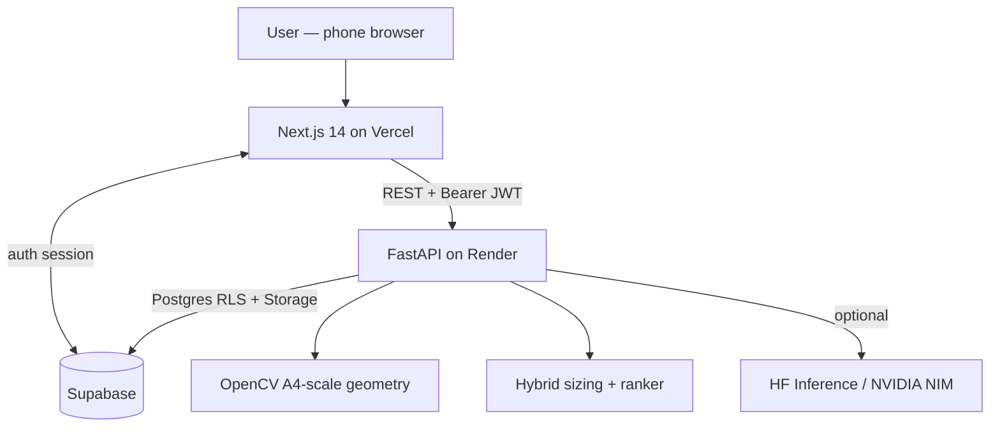

# one8 FitLab — AI Fit & Performance Studio

> **Portfolio project** built for an application to Virat Kohli's [one8](https://one8.com/) high-performance footwear brand.

A full-stack web app that solves the single biggest problem in online footwear retail — **fit-driven returns** — using a phone-camera **AI foot scan** fused with a **run-profile recommender**. The result: an explainable, ranked list of one8 shoes sized *for your actual foot* and matched to *how you move*.

**Live demo:** *(coming soon — deploy with the steps below and add your URL here)*

---

## Why this exists

| Problem | one8's pain | FitLab's solution |
|---|---|---|
| ~30 % of footwear returned due to wrong fit | High return cost, brand damage | Phone-camera CV measures real foot in mm against an A4 reference |
| Static size charts ignore model variance | Customers size wrong per model | Per-model sizing engine (each one8 model fits differently) |
| Generic recommendations ignore biomechanics | Missed upsell, wrong shoe | Goals questionnaire + Cadence Tapper → AI hybrid ranker |
| No fit confidence signal at checkout | Abandoned carts | Fit badge (true/snug/roomy) + match score + plain-language rationale |

---

## What's unique

1. **Reference-object CV measurement** — a foot photographed on an A4 sheet is measured to ±3 mm using the sheet's known 210 × 297 mm dimensions as a calibration ruler. No depth sensor. No app download. Works on any modern phone browser.
2. **Cadence Tapper** — the runner taps in rhythm with one foot-strike for 8 seconds (spacebar or tap); the browser computes running cadence (spm) and sends it to the same `/scan/gait` endpoint that a pose-estimation model would feed in production. A real biomechanical signal with zero video permissions needed.
3. **Per-model sizing engine** — every one8 model has its own internal last geometry; the same foot gets a different size recommendation per model, matching how real shoe fitting works.
4. **Explainable hybrid ranker** — a weighted rules engine (fit 40 %, sport 20 %, gait 15 %, surface 12 %, cushioning 13 %) with an optional LLM rationale layer; always produces a result even when hosted inference is down.
5. **Shareable fit card** — download as PNG (`html-to-image`) or share via Web Share API, with measurement + top pick + match score, branded one8 FitLab.

---

## Architecture



| Layer | Technology | Hosting |
|---|---|---|
| Frontend | Next.js 14 App Router, TypeScript, Tailwind, Framer Motion | Vercel (free) |
| Backend | FastAPI, Python 3.11, OpenCV, PyJWT | Render (free, Docker) |
| Database | Supabase Postgres + RLS | Supabase (free) |
| Auth | Supabase magic-link (passwordless) | Supabase |
| Storage | Supabase private Storage buckets | Supabase |
| CV scale | OpenCV + pure-Python geometry (`services/geometry.py`) | In-process |
| Segmentation | HF Inference `briaai/RMBG-1.4` (optional) | Hosted inference |
| LLM rationale | Any OpenAI-compatible endpoint (optional) | Hosted inference |

---

## Project structure

```
one8-fitlab/
├── backend/               FastAPI service
│   ├── app/
│   │   ├── main.py        App entrypoint, CORS, router wiring
│   │   ├── config.py      Pydantic settings (env-file backed)
│   │   ├── schemas.py     Shared Pydantic request/response models
│   │   ├── deps.py        Supabase JWT auth dependency
│   │   ├── data/
│   │   │   └── catalog.py  Mock one8 catalog + per-model size charts
│   │   ├── routers/
│   │   │   ├── catalog.py   GET /catalog
│   │   │   ├── scan.py      POST /scan/foot  /scan/foot/manual  /scan/gait
│   │   │   ├── size.py      POST /size
│   │   │   ├── recommend.py POST /recommend
│   │   │   └── scans.py     GET/POST/DELETE /scans  (auth required)
│   │   └── services/
│   │       ├── geometry.py   Pure-Python A4 scale math (unit-testable)
│   │       ├── cv_pipeline.py OpenCV pipeline + classical fallback
│   │       ├── sizing.py      Deterministic per-model sizing engine
│   │       ├── gait.py        Gait/support-profile descriptor
│   │       ├── recommender.py Weighted hybrid ranker + LLM hook
│   │       └── db.py          Thin PostgREST HTTP client (no SDK)
│   ├── tests/             26 pytest unit + contract tests (all pass)
│   ├── scripts/
│   │   └── generate_seed.py  Regenerates supabase/seed.sql from catalog
│   ├── Dockerfile
│   ├── render.yaml        Render Blueprint
│   └── requirements.txt
│
├── frontend/              Next.js app
│   ├── src/
│   │   ├── app/
│   │   │   ├── layout.tsx         Root layout + AuthProvider
│   │   │   ├── page.tsx           Landing / hero
│   │   │   ├── studio/page.tsx    6-step Scan Wizard (main feature)
│   │   │   ├── history/page.tsx   Saved scan history (auth-gated)
│   │   │   └── login/page.tsx     Magic-link sign-in
│   │   ├── components/
│   │   │   ├── SiteHeader.tsx     Nav with auth state
│   │   │   ├── FitBadge.tsx       true / snug / roomy badge
│   │   │   ├── Stepper.tsx        Step progress indicator
│   │   │   ├── SegmentedControl.tsx Goals questionnaire pill picker
│   │   │   ├── CadenceTapper.tsx  Tap-to-measure running cadence
│   │   │   ├── RecommendationCard.tsx Product card + match score bar
│   │   │   └── FitCard.tsx        Shareable PNG fit card
│   │   └── lib/
│   │       ├── api.ts         Typed FastAPI client
│   │       ├── supabase.ts    Browser Supabase client (nullable)
│   │       └── AuthProvider.tsx  Auth context + magic link
│   └── public/products/     6 SVG shoe illustrations (brand-consistent)
│
├── supabase/
│   ├── migrations/
│   │   ├── 0001_init.sql     Schema: products, size_charts, scans, profiles, recommendations
│   │   └── 0002_rls_and_storage.sql  Row Level Security + private buckets
│   └── seed.sql              Generated catalog data (54 size chart rows)
│
└── README.md
```

---

## Quick start (local)

### Prerequisites
- Python 3.11+
- Node.js 18+
- A Supabase project (free) — optional; the app works without it in demo mode

### 1 — Backend

```bash
cd backend
python -m venv .venv
# Windows:
.venv\Scripts\activate
# macOS / Linux:
source .venv/bin/activate

pip install -r requirements-dev.txt

# Copy and fill in env vars (all optional for local demo):
cp .env.example .env

uvicorn app.main:app --reload
# API available at http://localhost:8000
# Interactive docs: http://localhost:8000/docs
```

### 2 — Frontend

```bash
cd frontend
npm install
cp .env.local.example .env.local
# Edit .env.local — set NEXT_PUBLIC_API_BASE=http://localhost:8000
# Set NEXT_PUBLIC_SUPABASE_URL and NEXT_PUBLIC_SUPABASE_ANON_KEY if using auth

npm run dev
# App available at http://localhost:3000
```

### 3 — Supabase (optional — enables scan history)

1. Create a free project at [supabase.com](https://supabase.com).
2. In the SQL Editor, run `supabase/migrations/0001_init.sql`, then `0002_rls_and_storage.sql`, then `supabase/seed.sql`.
3. Copy your **Project URL**, **anon key**, **service role key**, and **JWT secret** into the respective `.env` and `.env.local` files.

---

## Backend API reference

| Method | Path | Description |
|---|---|---|
| `GET` | `/health` | Health check + capability report |
| `GET` | `/catalog` | List all 6 one8 models |
| `POST` | `/scan/foot` | Upload foot photo → length/width mm + confidence |
| `POST` | `/scan/foot/manual` | Enter foot length in cm → measurement |
| `POST` | `/scan/gait` | Submit cadence/pronation signals → gait profile |
| `POST` | `/size` | product_id + measurements → size label + fit badge |
| `POST` | `/recommend` | measurements + goals + gait → ranked one8 recommendations |
| `POST` | `/scans` | Save a completed scan (auth required) |
| `GET` | `/scans` | List your saved scans (auth required) |
| `DELETE` | `/scans/{id}` | Delete a saved scan (auth required) |

Full interactive docs at `/docs` (Swagger UI) and `/redoc`.

---

## Environment variables

### Backend (`backend/.env`)

| Variable | Required | Description |
|---|---|---|
| `CORS_ORIGINS` | Yes (prod) | Comma-separated allowed browser origins |
| `SUPABASE_URL` | For persistence | Your Supabase project URL |
| `SUPABASE_SERVICE_KEY` | For persistence | Service role key (server-side only) |
| `SUPABASE_JWT_SECRET` | For auth | Project JWT secret (Settings → API) |
| `HF_API_TOKEN` | Optional | HF Inference token for segmentation model |
| `LLM_API_BASE` | Optional | OpenAI-compatible LLM endpoint for rationale rewriting |
| `LLM_API_KEY` | Optional | API key for LLM endpoint |
| `LLM_MODEL` | Optional | Model name string |

### Frontend (`frontend/.env.local`)

| Variable | Required | Description |
|---|---|---|
| `NEXT_PUBLIC_API_BASE` | Yes | Backend URL (e.g. `https://one8-fitlab-api.onrender.com`) |
| `NEXT_PUBLIC_SUPABASE_URL` | For auth | Your Supabase project URL |
| `NEXT_PUBLIC_SUPABASE_ANON_KEY` | For auth | Supabase anon (public) key |

---

## Running tests

```bash
cd backend
.venv/Scripts/activate  # or source .venv/bin/activate
pytest -v
# 26 tests — geometry, sizing, recommender, scans auth, API contracts
```

---

## Deployment

### Frontend → Vercel

1. Push the repo to GitHub.
2. Import the project in [vercel.com](https://vercel.com) → select the `frontend/` directory as the root.
3. Set the three `NEXT_PUBLIC_*` environment variables in Vercel's Project Settings.
4. Deploy — Vercel auto-detects Next.js and runs `npm run build`.

### Backend → Render

**Option A — Render Blueprint (easiest):**
1. Connect your GitHub repo in the Render dashboard.
2. Click "New Blueprint" and select `render.yaml` at the repo root.
3. Fill in the environment variable values (Supabase keys, CORS origin = your Vercel URL).
4. Deploy — Render builds the Docker image and runs the container.

**Option B — Fly.io:**
```bash
cd backend
fly launch  # follow prompts; it detects the Dockerfile automatically
fly secrets set CORS_ORIGINS=https://your-vercel-url.vercel.app SUPABASE_URL=... ...
fly deploy
```

**Option C — Any Docker host:**
```bash
cd backend
docker build -t one8-fitlab-api .
docker run -p 8000:8000 --env-file .env one8-fitlab-api
```

---

## Business impact case

| Metric | Industry baseline | FitLab target |
|---|---|---|
| Return rate (footwear) | 25–35 % | < 12 % (AI-sized orders) |
| Checkout conversion | Drops with size uncertainty | +8–15 % (fit confidence reduces abandonment) |
| Average order value | Standard | +AOV via sport/gait matching (recommends right performance tier) |
| Data asset | None | Per-foot biometric + preference graph per user |

---

## Tech choices rationale

- **FastAPI** — async Python, auto-generated OpenAPI docs, perfect for ML pipelines. Render free tier boots cold in ~3 s.
- **OpenCV (headless)** — 40 MB, zero cost, runs the A4-reference CV pipeline entirely in-process with no inference API call needed for the core measurement path.
- **Supabase** — Postgres + RLS + Auth + Storage in one free project; avoids building auth from scratch while remaining genuinely open-source.
- **Next.js 14 App Router** — co-locates server and client components, excellent mobile performance, Vercel zero-config deploy.
- **`html-to-image`** — zero native deps, generates the shareable fit card PNG client-side without a server round trip.
- **Hosted HF / NVIDIA NIM** — optional segmentation and LLM inference without GPU cost; purely additive, the app degrades gracefully if unavailable.

---

## Known limitations & roadmap

- [ ] Actual foot-photo segmentation refinement via HF RMBG model (wired but needs `HF_API_TOKEN`)
- [ ] Real one8 product catalog + images (this uses a curated demo set)
- [ ] Video gait analysis via NVIDIA NIM pose estimation (the endpoint contract is already defined — the Cadence Tapper is the production-ready interim)
- [ ] Checkout / cart integration (out of scope — this is the pre-purchase fit tool)
- [ ] Native iOS / Android app (camera access + AR overlay would improve scan UX)

---

## Disclaimer

This is an independent portfolio project. It is not affiliated with, endorsed by, or connected to Virat Kohli, one8 Commune Private Limited, or any of their partners. The one8 catalog data is entirely fictional and illustrative. No real products, prices, or inventory are represented.
